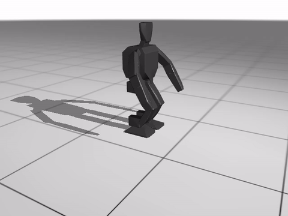

# Learning-Based Locomotion for Humanoid Robot

This repository contains the training infrastructure and saved high-performance policies for the ROBOTIS OP3 humanoid robot. The primary goal is to achieve robust sim-to-real transfer of learned locomotion gaits, using Webots as an intermediate validation stage before physical deployment.



## Project Structure

- rl_trained_policies/: Directory containing all trained reinforcement learning policies.

- onnx_model/: Storage for policies converted to ONNX format for deployment.

- scripts/: Additional utility scripts supplementing the mujoco_playground suite.

- mujoco_playground/learning/: Core training logic.

## Requirements

This project relies on the MuJoCo Playground framework. Please follow the installation instructions in the MuJoCo Playground README to set up the required libraries and environments.

## Usage & Commands

- Training policies

```
uv --no-config run train-jax-ppo --env_name Op3Joystick
```
- Training policies with domain randomization

Place randomize.py inside mujoco_playground/mujoco_playground/_src/locomotion/op3/. The base OP3 environment does not include domain randomization, this file adds a custom implementation. Also replace __init__.py file in mujoco_playground/mujoco_playground/_src/locomotion/ .

```
uv --no-config run python learning/train_jax_ppo.py \
  --env_name Op3Joystick \
  --domain_randomization \
  --num_timesteps 300000000 \
  --normalize_observations
```

Training was run for 300M steps, though this and other parameters (number of environments, etc.) can be adjusted. To review all configurable options, run:

```

uv --no-config run train-jax-ppo --helpful
```

- Visualisation & Testing

```

uv run train-jax-ppo --env_name Op3Joystick --play_only \
  --load_checkpoint_path <checkpoint_path> \
  --num_videos 1
```

- Model Conversion

```

python scripts/convert_brax_to_onnx.py --ckpt <checkpoint_path>/<checkpoint_no>
```

## Training Configuration

Freq: $50\text{ Hz}$ ($\Delta t_{sim}=4\text{ ms}$, $\Delta t_{ctrl}=20\text{ ms}$).

Obs ($147$-dim): $3 \times 49$ frames (Gyro, Up-vector, Cmd, Joint offsets, Last action).

Default Pose: stand_bent_knees keyframe reference from Mujoco.

PD Gains: $K_p=21.1$ (MuJoCo) / $8.0$ (Webots), $K_d=1.084$ (MuJoCo) / $0.2$ (Webots), Action scale=$0.3$ (MuJoCo) / $0.21$ (Webots).

## Deployment Logic

Some physical parameters in the Webots controller were tuned to better match MuJoCo's physics model.

Gyro: Roll=$G_x$, Pitch=$-G_z$.

Yaw Rate: $\dot{\psi} = \text{wrap}(\psi_t - \psi_{t-1}) / \Delta t$.

Up-Vector: Third row of rotation matrix ($R[2][0..2]$).

Control: Subscribes to /cmd_vel (geometry_msgs/Twist).

## Sim-to-Sim Demo


